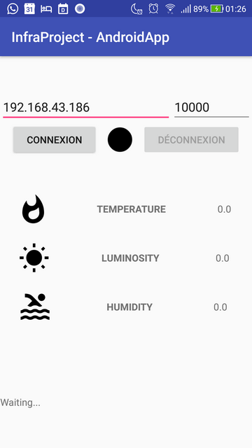
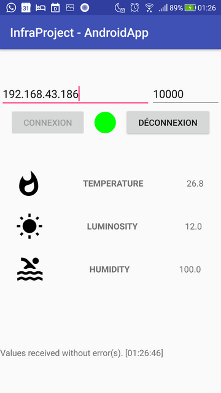
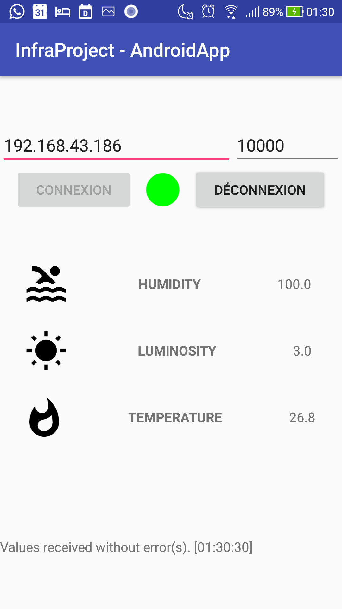
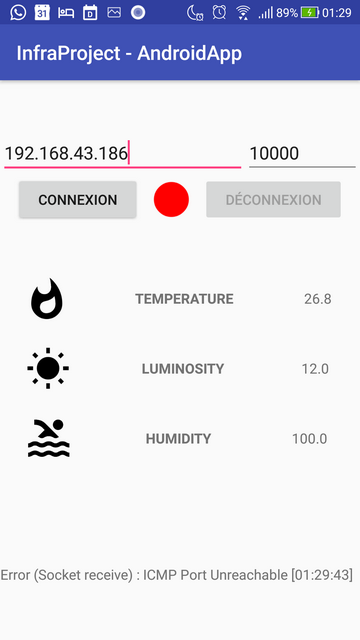

# CPE-S7_IOT_InfraProject
Projet "Infrastructure" - "Internet Of Things" - CPE Lyon (S7)

## Application Android

Cette application Android communique avec la Raspberry Pi, avec 3 messages :
- Un message afin de tester la connexion [`TEST_CONNECTION`]
- Un message afin d'indiquer l'ordre d'affichage des capteurs [`TLH`,`HTL`,`LTH`,...]
- Un message afin de demander l'émission des données des capteurs [`getValues()`]

### Captures d'écran

_De gauche à droite, captures d'écran de l'application, avant la connexion, pendant la réception des données (avec modification de l'ordre d'affichage des capteurs), et après la déconnexion._  

### Principes

Lors de l'appui sur le bouton correspondant, l'application enclenche la procédure de connexion, à savoir l'envoi d'un packet UDP afin de déterminer si l'hôte distant (la Raspberry Pi) existe. Comme UDP n'établit pas de connexion et n'attend pas de réponse, un timeout est défini, et l'application s'attend à recevoir le message qu'elle a envoyé dans le temps imparti. Si elle reçoit effectivement une réponse, elle maintient le Socket UDP. **On simule donc l'établissement d'une connexion, alors qu'UDP n'en est pas capable de base.** 

À partir du moment où la connexion est établie, **un Timer est créé, qui envoie le message `getValues()` à intervalles régulières, mais également une tâche asynchrone qui effectue un `Socket.receive` en boucle.** Si l'on modifie l'ordre d'affichage des données, le message correspondant est également envoyé.  

Dès l'instant où la connexion est interrompue (erreur à la connexion ou déconnexion manuelle via le bouton, mais pas pendant la réception), ces opérations sont interrompues (Socket fermé, Timer et AsyncTask annulés).

Les informations reçues, ou les éventuelles erreurs, sont remontées à la classe principale (`MainActivity`) via deux interfaces, permettant d'afficher ces informations à l'utilisateur.

### Architecture

Toute l'architecture a été pensée afin de permettre à l'application d'évoluer en cas de besoin, mais aussi pour séparer les différentes partie de l'application, chacune ayant ses responsabilités.
Cependant, les multiples réorganisations de celle-ci ont conduit à la création de nombreux liens, et certains sont peut-être superflus.

#### Package `dndrv_helpers`

Classes et interfaces liées à l'implémentation d'un `RecyclerView` permettant le "Drag & Drop" de ses éléments.

`EditItemTouchHelperCallback`
`ItemAdapter`
`ItemTouchHelperAdapter`
`ItemTouchHelperViewHolder`
`OnStartDragListener`

Sources :
- https://mobologicplus.com/drag-and-drop-item-of-recyclerview-in-android/
- https://medium.com/@ipaulpro/drag-and-swipe-with-recyclerview-6a6f0c422efd

#### Package `interfaces`

Interfaces permettant la remontée des informations à la classe principale.

`OnErrorEncountered` : Remontée des erreurs
`OnTaskCompleted` : Remontée de données variées

#### Package `network`

Classes liées aux problématiques réseau (Connexion, envoi et réception de packets).

- `MessageThread` : Permet l'envoi d'un message
- `NetworkConnectionTask` : Permet la connexion et simule une connexion bidirectionnelle
- `NetworkManager` : Lancement de la connexion, déconnexion, envoi/réception de message, gestion des conséquences de la (dé)connexion
- `ReceiverTask` : Permet la réception de messages

#### Package `sensors`

Classes liées à l'affichage des données des capteurs.

- `SensorData` : Classe représentant un capteur (Icône, Titre, Type, Valeur)
- `SensorsManager` : Récupération de la liste des capteurs, initialisation de l'Adapter, mise à jour des valeurs des capteurs
- `SensorTypeEnum` : Énumération des types de capteurs existants
